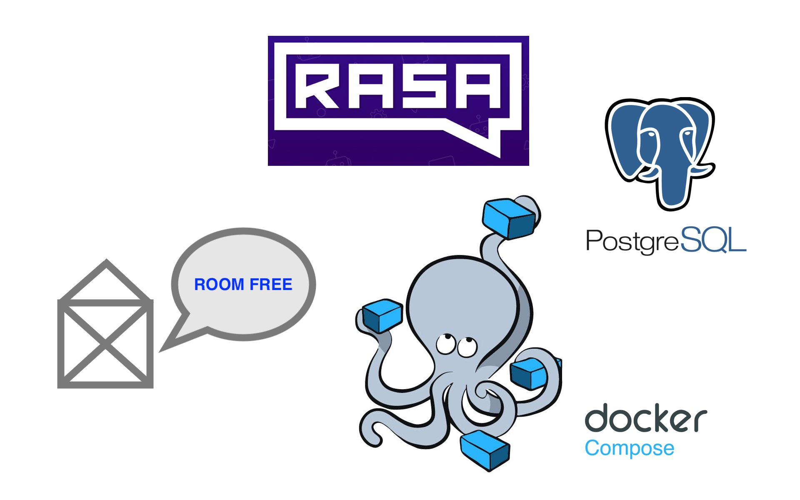

Hotel Chatbot
=============




Description
---------------

This is a chatbot based on the open-source framework of [Rasa](https://rasa.com/). The domain of hotels works as a show case to make comprehension of advanced functionalities more availbale. The setup includes a docker version for server-level tests.

Installation
---------------

First you have to grant permissions for the intialization shell script. This will than set the required outstanding permissions for the other shell scripts and create the required database folder ./db and model folder ./models.

```
> sudo chmod -R 777 initRun.sh
> ./initRun.sh
```

Further, this project uses [docker](https://www.docker.com/) as a requirement to run the chatbot. If you are not sure whether docker is installed on your machine execute the following command:

```
> docker -v && docker-compose -v
# Docker version 18.06.1-ce, build e68fc7a
# docker-compose version 1.22.0, build f46880f
```

Usage
---------------

To host the bot on a local server, you can run the shell script `./startRun.sh`. This will build and run the rasa server and action server from the two docker images `./DockerfileRasa`, `./DockerfileAction` and host them together with a Postgres SQL server via the `./docker-compose.yml` script. If you don't want to use the server side, but run it directly in your shell, you can refer to the documentation of rasa, where you will find a manual to do so. 

To stop the server again, run the shell script `./stopRun.sh`. This will also ask you, if you want to prune your Docker containers and volumes. If you don't want to lose other Docker containers, do not accept this and edit it in the shell script, by deleting the last line in `./stopRun.sh`. However, I find it for myself most practical, to prune the system after hosting, so that Docker containers don't eat up my storage space.

### Bot API

With hosting the bot on a local server, you will be able to call it via local API requests. To execute a POST request, use the following form:

`curl -XPOST http://localhost:5005/webhooks/rest/webhook \
  -H "Content-type: application/json" \
  -d '{"sender": "test", "message": "hello"}'
  `

### SQL API

With hosting the bot, you will have access to all the chat history and metadata through a Postgres SQL server. To access it, you can run the shell script `./startSQL.sh`. The username and keys will be the same, as defined in `./endpoints.yml` and `./docker-compose.yml`.
